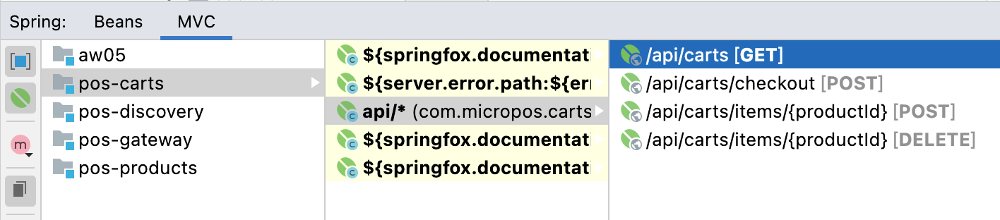
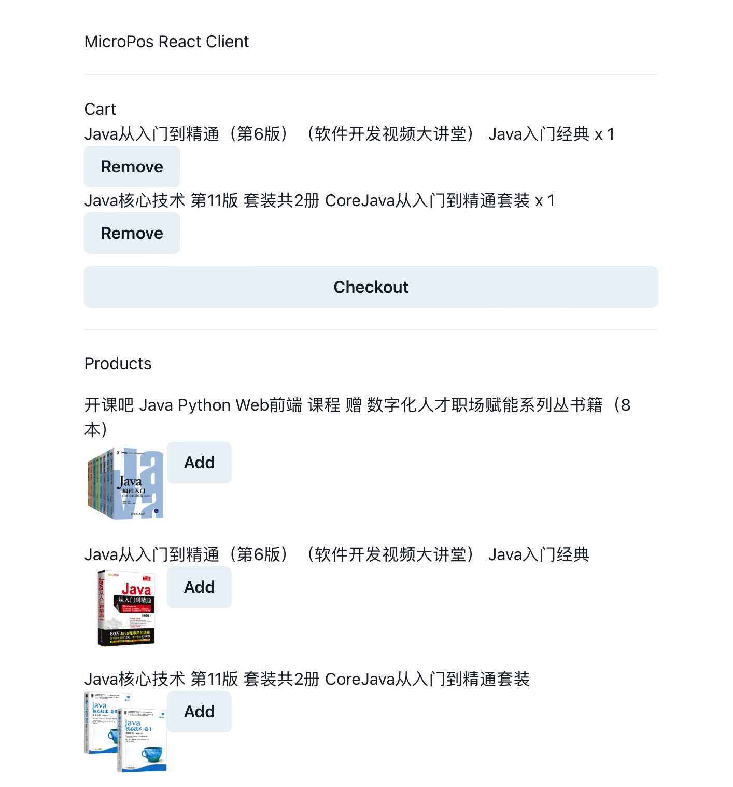

# RESTful microPoS 

实现结果如下：

1. 购物车服务定义了四个接口
    - 
    - `GET /api/carts`获取购物车
    - `POST /api/checkout`结账并清空购物车
    - `POST /api/carts/items/{productId}`向购物车添加商品
    - `DELETE /api/carts/items/{productId}`从购物车删除商品
3. 商品服务使用ehcache缓存商品列表和商品信息
4. 用Eureka做服务发现注册，使用`RestTemplate`实现服务间的调用
5. 使用React实现了简单的web应用，效果如下图

缺点： 目前API还是和之前一样用session区分用户的，不太符合Restful API无状态的要求

> 请参考spring-petclinic-rest/spring-petclinic-microserivces 将aw04的webpos项目改为rest风格的微服务架构
> （至少包含产品管理服务pos-products和购物车管理服务pos-carts以及discovery/gateway等微服务架构下需要的基础设施服务）。具体要求包括：
> 1. 请使用OpenAPI的定义每个服务的rest接口（参考pos-products）
> 2. 请使用ehcache管理缓存；
> 3. 请注意使用断路器等机制；
> 4. 有兴趣的同学可自学一些reactjs或vuejs等为microPoS开发一个前端。

